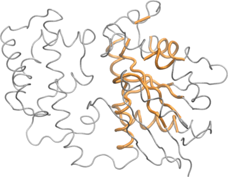
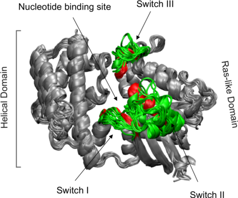
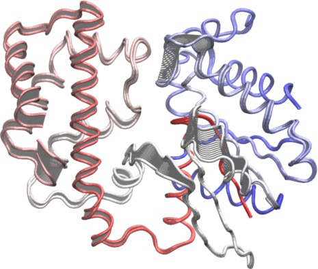

\newpage

# Background {.unnumbered}

Bio3D[^1] is an R package that provides interactive tools for the
analysis of bimolecular structure, sequence and simulation data. The aim
of this document, termed a vignette[^2] in R parlance, is to provide a
brief task-oriented introduction to facilities for analyzing protein
structure data with Bio3D [@grant06].

## Requirements {.unnumbered}

Detailed instructions for obtaining and installing the Bio3D package on
various platforms can be found in the [Installing
Bio3D](http://thegrantlab.org/bio3d/tutorials) vignette available online.
Note that to follow along with this vignette the [MUSCLE multiple
sequence alignment program](http://www.drive5.com/muscle/) must be installed
on your system and in the search path for executables. Please see the
installation vignette for full details. This particular vignette was generated
using **Bio3D version `r packageVersion("bio3d")`**.

# Getting Started

Start R, load the Bio3D package and use the command `demo("pdb")` and
then `demo("pca")` to get a quick feel for some of the tasks that we
will be introducing in the following sections.

```{r, eval=FALSE}
library(bio3d)
demo("pdb")
demo("pca")
```

```{r, echo=FALSE}
library(bio3d)
```

#### Side-note: {.unnumbered}

You will be prompted to hit the `RETURN` key at each step of the demos
as this will allow you to see the particular functions being called.
Also note that detailed documentation and example code for each function
can be accessed via the `help()` and `example()` commands (e.g.
`help(read.pdb)`). You can also copy and paste any of the example code
from the documentation of a particular function, or indeed this
vignette, directly into your R session to see how things work. You can
also find this [documentation
online](http://thegrantlab.org/bio3d/html/index.html).


## Working with single PDB structures
A comprehensive introduction to working with PDB format structures with Bio3D
can be found in `PDB structure manipulation and analysis` vignette. Here we
confine ourselves to a very brief overview. The code snippet below calls the
`read.pdb()` function with a single input argument, the four letter Protein
Data Bank (PDB) identifier code `"1tag"`. This will cause the `read.pdb()`
function to read directly from the online RCSB PDB database and return a new
object `pdb` for further manipulation.

```{r, eval=TRUE}
pdb <- read.pdb("1tag")
```

Alternatively, you can read a PDB file directly from your local file
system using the file name (or the full path to the file) as an argument
to `read.pdb()`:
```{r, eval=FALSE}
pdb <- read.pdb("myfile.pdb")
pdb <- read.pdb("/path/to/my/data/myfile.pdb")
```

A short summary of the `pdb` object can be obtained by calling
the function `print.pdb()` (or simply typing  `pdb`, which is equivalent in this case):
```{r}
pdb
```

To examine the contents of the `pdb` object in more detail we can use
the `attributes` function:
```{r, eval=TRUE}
attributes(pdb)
```

These attributes describe the list components that comprise the `pdb`
object, and each individual component can be accessed using the `$`
symbol (e.g. `pdb$atom`). Their complete description can be found on the
`read.pdb()` functions help page accessible with the command:
`help(read.pdb)`. Note that the `atom` component is a data frame
(matrix like object) consisting
of all atomic coordinate ATOM/HETATM data, with a row per ATOM and a column per
record type. The column names can be used as a convenient means of data
access, for example to access coordinate data for the first three atoms
in our newly created `pdb` object:

```{r}
pdb$atom[1:3, c("resno","resid","elety","x","y","z")]
```

In the example above we used numeric indices to access atoms 1 to 3, and
a character vector of column names to access the specific record types.
In a similar fashion the `atom.select()` function returns numeric
indices that can be used for accessing desired subsets of the `pdb`
data. For example:

```{r, results="hide"}
ca.inds <- atom.select(pdb, "calpha")
```

The returned `ca.inds` object is a list containing atom and xyz numeric
indices corresponding to the selection (all C-alpha atoms in this
particular case). The indices can be used to access e.g. the Cartesian
coordinates of the selected atoms (`pdb$xyz[, ca.inds$xyz]`), or residue
numbers and B-factor data for the selected atoms. For example:

```{r, fig.cap="Residue B-factor data for PDB id 1TAG. Grey boxes depict secondary structure elements in the structure (dark grey: alpha helices; light grey: beta sheets)."}
# See Figure 1
bf <- pdb$atom$b[ca.inds$atom]
plot.bio3d(bf, resno=pdb, sse=pdb, ylab="B-factor", xlab="Residue", typ="l")
```

In the above example we use these indices to plot residue number (taken from
the `pdb` object, note these residue numbers do not start at 1) vs
B-factor along with a basic secondary structure schematic (again taken from
the `pdb` object and provided with the argument `sse=pdb`; Figure 1). Note also
that we could of also accessed this same data with `pdb$atom$b[ca.inds$atom, "b"]`.
As a further example of data access lets extract the sequence for the loop region (P-loop) between beta 1
(the third strand in the beta sheet) and alpha 1 in our `pdb` object.

```{r}
loop <- pdb$sheet$end[3]:pdb$helix$start[1]
loop.inds <- atom.select(pdb, resno=loop, elety="CA")
pdb$atom[loop.inds$atom, "resid"]
```

In the above example the residue numbers in the `sheet` and `helix`
components of `pdb` are accessed and used in a subsequent atom
selection, the output of which is used as indices to extract residue
names.

Since Bio3D version 2.1 the \texttt{xyz} component in the PDB object is in a
matrix format (as compared to a vector format in previous versions). Thus, notice
the extra comma in the square bracket operator when accessing Cartesian
coordinates from the \texttt{xyz} object (\texttt{pdb\$xyz[, ca.inds\$xyz]}).

#### Question: {.unnumbered}

How would you extract the one-letter amino acid sequence for the loop
region mentioned above? HINT: The `aa321()` function converts between
three-letter and one-letter IUPAC amino acid codes.

#### Question: {.unnumbered}

How would you select all backbone or sidechain atoms? HINT: see the example
section of `help(atom.select)` and the `string` option.

#### Side-note: {.unnumbered}

Consider the `combine.sel` function for combining multiple atom selections.
See `help(combine.sel)` and additional vignettes for more details.

Note that if you know a particular sequence pattern or motif characteristic
of a region of interest you cold access it via a sequence search as follows:

```{r}
aa <- pdbseq(pdb)
aa[ motif.find(".G....GK[ST]", aa )]
```


## Working with multiple PDB structures

The Bio3D package was designed to specifically facilitate the analysis
of multiple structures from both experiment and simulation. The
challenge of working with these structures is that they are usually
different in their composition (i.e. contain differing number of atoms,
sequences, chains, ligands, structures, conformations etc. even for the
same protein as we will see below) and it is these differences that are
frequently of most interest.

For this reason Bio3D contains extensive utilities to enable the reading
and writing of sequence and structure data, sequence and structure
alignment, performing homologous protein searches, structure annotation,
atom selection, re-orientation, superposition, rigid core
identification, clustering, torsion analysis, distance matrix analysis,
structure and sequence conservation analysis, normal mode analysis
across related structures, and principal component analysis of
structural ensembles. We will demonstrate some of these utilities in the
following sections. More comprehensive demonstrations for special tasks, e.g.
various operations of PDB structures, analysis of MD trajectories
and normal mode analysis can be found in corresponding vignettes.

Before delving into more advanced analysis lets examine how we can read
multiple PDB structures from the RCSB PDB for a particular protein and
perform some basic analysis:

```{r quicktransducin, results="hide", cache=TRUE, warning=FALSE}
# Download some example PDB files
ids <- c("1TND_B","1AGR_A","1FQJ_A","1TAG_A","1GG2_A","1KJY_A")
raw.files <- get.pdb(ids)
```

The `get.pdb()` function will download the requested files, below we
extract the particular chains we are most interested in with the
function `pdbsplit()` (note these `ids` could come from the results of a
`blast.pdb()` search as described in subsequent sections). The requested
chains are then aligned and their structural data stored in a new object
`pdbs` that can be used for further analysis and manipulation.

```{r aligntransducin, results="hide"}
# Extract and align the chains we are interested in
files <- pdbsplit(raw.files, ids)
pdbs <- pdbaln(files)
```

Below we examine their sequence and structural similarity.
```{r basictransducin, warning=FALSE}
# Calculate sequence identity
pdbs$id <- substr(basename(pdbs$id),1,6)
seqidentity(pdbs)


## Calculate RMSD
rmsd(pdbs, fit=TRUE)
```

```{r, echo=FALSE}
rm(pdbs)
```

#### Question: {.unnumbered}

What effect does setting the `fit=TRUE` option have in the RMSD
calculation? What would the results indicate if you set `fit=FALSE` or
disparaged this option? HINT: Bio3D functions have various default
options that will be used if the option is not explicitly specified by
the user, see `help(rmsd)` for an example and note that the input
options with an equals sign (e.g. `fit=FALSE`) have default values.


## Exploring example data for the transducin heterotrimeric G Protein

A number of example datasets are included with the Bio3D package. The
main purpose of including this data (which may be generated by the user
by following the extended examples documented within the various Bio3D
functions) is to allow users to more quickly appreciate the capabilities
of functions that would otherwise require extensive data downloads
before execution.

For a number of the examples in the current vignette we will utilize the
included transducin dataset that contains over 50 publicly available
structures. This dataset formed the basis of the work described in
[@yao13] and we refer the motivated reader to this publication and
references therein for extensive background information. Briefly,
heterotrimeric G proteins are molecular switches that turn on and off
intracellular signaling cascades in response to the activation of G
protein coupled receptors (GPCRs). Receptor activation by extracellular
stimuli promotes a cycle of GTP binding and hydrolysis on the G protein
alpha subunit that leads to conformational rearrangements (i.e. internal
structural changes) that activate multiple downstream effectors. The
current dataset consists of transducin (including Gt and Gi/o) alpha
subunit sequence and structural data and can be accessed with the command
`attach(transducin)`:

```{r transducin, results="hide", message=FALSE,}
attach(transducin)
```

#### Side-note: {.unnumbered}

This dataset can be assembled from scratch with commands similar to
those detailed in the next section and those listed in section 2.2. Also
see `help(example.data)` for a full description of this datasets
contents.


# Constructing Experimental Structure Ensembles for a Protein Family

Comparing multiple structures of homologous proteins and carefully
analyzing large multiple sequence alignments can help identify patterns
of sequence and structural conservation and highlight conserved
interactions that are crucial for protein stability and function
[@grant07]. Bio3D provides a useful framework for such studies and
can facilitate the integration of sequence, structure and dynamics data
in the analysis of protein evolution.

## Finding Available Sets of Similar Structures

In this tutorial, to collect available transducin crystal structures, we
first use BLAST to query the PDB database to find similar sequences (and
hence structures) to our chosen representative (PDB ID "1tag"):

```{r blast, results="hide", cache=TRUE}
pdb <- read.pdb("1tag")
seq <- pdbseq(pdb)
blast <- blast.pdb(seq)
```

Examining the alignment scores and their associated E-values (with the
function `plot.blast()`) indicates a sensible normalized score
(-log(E-Value)) cutoff of  240 bits (Figure 2).

```{r blasthits, fig.cap="Summary of BLAST results for query 1tag against the PDB chain database"}
# See Figure 2.
hits <- plot.blast(blast, cutoff=240)
```

We can then list a subset of our top hits, for example:

```{r}
head(hits$hits)
head(hits$pdb.id)
```

#### Sidenote: {.unnumbered}
The function `pdb.annotate()` can fetch detailed information about the
corresponding structures (e.g. title, experimental method, resolution,
ligand name(s), citation, etc.). For example:

```{r, warning=FALSE, message=FALSE}
anno <- pdb.annotate(hits$pdb.id)
head(anno[, c("resolution", "ligandId", "citation")])
```


## Multiple Sequence Alignment

Next we download the complete list of structures from the PDB (with
function `get.pdb()`), and use function `pdbsplit()` to split the
structures into separate chains and store them for subsequent access.
Finally, function `pdbaln()` will extract the sequence of each structure
and perform a multiple sequence alignment to determine residue-residue
correspondences (**NOTE:** requires external program *MUSCLE* be in
search path for executables):

```{r getpdbs, eval=FALSE}
# Download PDBs and split by chain ID
files <- get.pdb(hits, path="raw_pdbs", split = TRUE)

# Extract and align sequences
pdbs <- pdbaln(files)
```

You can now inspect the alignment (the automatically generated “aln.fa”
file) with your favorite alignment viewer (we recommend SEAVIEW,
available from:
[http://pbil.univ-lyon1.fr/software/seaview.html](http://pbil.univ-lyon1.fr/software/seaview.html)).

#### Side-note: {.unnumbered}

You may find a number of structures with missing residues (i.e. gaps in
the alignment) at sites of particular interest to you. If this is the
case you may consider removing these structures from your hit list and
generating a smaller, but potentially higher quality, dataset for
further exploration.

#### Question: {.unnumbered}

How could you automatically identify gap positions in your alignment?
HINT: try the command `help.search("gap", package="bio3d")`.


# Comparative Structure Analysis

The detailed comparison of homologous protein structures can be used to
infer pathways for evolutionary adaptation and, at closer evolutionary
distances, mechanisms for conformational change. The Bio3D package
employs both conventional methods for structural analysis (alignment,
RMSD, difference distance matrix analysis, etc.) as well as refined
structural superposition and principal component analysis (PCA) to
facilitate comparative structure analysis.

## Structure Superposition

Conventional structural superposition of proteins minimizes the root
mean square difference between their full set of equivalent residues.
This can be performed with Bio3D functions `pdbfit()` and `fit.xyz` as
outlined previously. However, for certain applications such a
superposition procedure can be inappropriate. For example, in the
comparison of a multi-domain protein that has undergone a hinge-like
rearrangement of its domains, standard all atom superposition would
result in an underestimate of the true atomic displacement by attempting
superposition over all domains (whole structure superposition). A more
appropriate and insightful superposition would be anchored at the most
invariant region and hence more clearly highlight the domain
rearrangement (sub-structure superposition).

The Bio3D `core.find()` function implements an iterated superposition
procedure, where residues displaying the largest positional differences
are identified and excluded at each round. The function returns an
ordered list of excluded residues, from which the user can select a
subset of ’core’ residues upon which superposition can be based.

```{r, results="hide", cache=TRUE}
core <- core.find(pdbs)
```
The `plot.core()` and `print.core()` functions allow one to further examine
the output of the `core.find()` procedure (see below and Figure 3).

```{r, fig.cap="Identification of core residues"}
# See Figure 3.
col=rep("black", length(core$volume))
col[core$volume<2]="pink"; col[core$volume<1]="red"
plot(core, col=col)
```

The `print.core()` function also returns `atom` and `xyz` indices
similar to those returned from the `atom.select()` function. Below we
use these indices for core superposition and to write a quick PDB file
for viewing in a molecular graphics program such as VMD (Figure 4).

```{r}
core.inds <- print(core, vol=1.0)
write.pdb(xyz=pdbs$xyz[1,core.inds$xyz], file="quick_core.pdb")
```



We can now superpose all structures on the selected core indices with
the `fit.xyz()` or `pdbfit()` function.

```{r}
xyz <- pdbfit( pdbs, core.inds )
```

The above command performs the actual superposition and stores the new
coordinates in the matrix object `xyz`.

#### Side-note: {.unnumbered}

By providing an extra `outpath="somedir"` argument to `pdbfit` the
superposed structures can be output for viewing (in this case to the
local directory `somedir` which you can obviously change). These fitted
structures can then be viewed in your favorite molecular graphics
program (Figure 5).





## Standard Structural Analysis

Bio3D contains functions to perform standard structural analysis, such
as root mean-square deviation (RMSD), root mean-square fluctuation
(RMSF), secondary structure, dihedral angles, difference distance
matrices etc. The current section provides a brief exposure to using
Bio3D in this vein. However, do feel free to skip ahead to the arguably
more interesting section on PCA analysis.

#### Root mean square deviation (RMSD): {.unnumbered}

RMSD is a standard measure of structural distance between coordinate
sets. Here we examine the pairwise RMSD values and cluster our
structures based on these values:

```{r, warning=FALSE, fig.cap="Histogram of RMSD among transducin structures"}
rd <- rmsd(xyz)
hist(rd, breaks=40, xlab="RMSD (Å)", main="Histogram of RMSD")
```

```{r, echo=TRUE}
# RMSD clustering
hc.rd <- hclust(as.dist(rd))
```

The result can be illustrated as a simple dendrogram with the command:
```{r, fig.width=7, fig.height=5, fig.cap="RMSD clustering of transducin structures"}
pdbs$id <- substr(basename(pdbs$id), 1, 6)
hclustplot(hc.rd, colors=annotation[, "color"], labels=pdbs$id, cex=0.5,
          ylab="RMSD (Å)", main="RMSD Cluster Dendrogram", fillbox=FALSE)
```

#### Question:  {.unnumbered}
How many structure groups/clusters do we have according to this clustering? How would determine which structures are assigned to which cluster? HINT: See `help(cutree)`.

#### Question:  {.unnumbered}
What kind of plot would the command `heatmap(rd)` produce? How would you label this plot with PDB codes? HINT: labCol and labRow.


#### Root mean squared fluctuations (RMSF): {.unnumbered}
RMSF is another often used measure of conformational variance. The Bio3D `rmsf()` function returns a vector of atom-wise (or residue-wise) variance instead of a single numeric value. The below sequence of commands returns the indices for gap containing
positions,  which we then exclude from subsequent RMSF calculation:

```{r, fig.cap="RMSF plot"}
# Ignore gap containing positions
gaps.res <- gap.inspect(pdbs$ali)
gaps.pos <- gap.inspect(pdbs$xyz)

# Tailor the PDB structure to exclude gap positions for SSE annotation
id = grep("1TAG", pdbs$id)
ref.pdb = trim.pdb(pdb, inds=atom.select(pdb, resno = pdbs$resno[id, gaps.res$f.inds]))

# Plot RMSF with SSE annotation and labeled with residue numbers (Figure 8.)
rf <- rmsf(xyz[, gaps.pos$f.inds])
plot.bio3d(rf, resno=ref.pdb, sse=ref.pdb, ylab="RMSF (Å)", xlab="Residue No.", typ="l")
```


#### Torsion/Dihedral analysis: {.unnumbered}

The conformation of a polypeptide or nucleotide chain can be usefully
described in terms of angles of internal rotation around its constituent
bonds.

```{r, fig.cap="Basic Ramachandran plot"}
tor <- torsion.pdb(pdb)

# Basic Ramachandran plot (Figure 9)
plot(tor$phi, tor$psi, xlab="phi", ylab="psi")
```

Lets compare the Calpha atom based pseudo-torsion angles between two structures,
the inactive (PDB ID 1TAG) and active (PDB ID 1TND) transducin alpha subunit:

```{r, fig.cap="Torsion angle difference between structures in inactive GDP bound (1tag) and active GTP analogue bound (1tnd) states"}
# Locate the two structures in pdbs
ind.a <- grep("1TAG_A", pdbs$id)
ind.b <- grep("1TND_B", pdbs$id)

# Exclude gaps in the two structures to make them comparable
gaps.xyz2 <- gap.inspect(pdbs$xyz[c(ind.a, ind.b), ])
a.xyz <- pdbs$xyz[ind.a, gaps.xyz2$f.inds]
b.xyz <- pdbs$xyz[ind.b, gaps.xyz2$f.inds]

# Compare CA based pseudo-torsion angles between the two structures
a <- torsion.xyz(a.xyz, atm.inc=1)
b <- torsion.xyz(b.xyz, atm.inc=1)
d.ab <- wrap.tor(a-b)
d.ab[is.na(d.ab)] <- 0

# Plot results with SSE annotation
plot.bio3d(abs(d.ab), resno=pdb, sse=pdb, typ="h", xlab="Residue No.", ylab = "Difference Angle")
```


#### Difference distance matrix analysis (DDM) {.unnumbered}

Distance matrices can be calculated with the function `dm()` and contact
maps with the function `cmap()`. In the example below we calculate the
difference distance matrix by simply subtracting one distance matrix from
another. Note the vectorized nature of the this calculation (i.e. we do not
have to explicitly iterate through each element of the matrix):

```{r, fig.width=5.5, results="hide", fig.cap="Difference of distance matrices between structures in GDP(1tag) and GTP(1tnd) nucleotide states"}
a <- dm.xyz(a.xyz)
b <- dm.xyz(b.xyz)

plot.dmat( (a - b), nlevels=10, grid.col="gray", xlab="1tag", ylab="1tnd")
```

#### Question: {.unnumbered}

Can you think of the pros and cons of these different analysis methods?


# Principal Component Analysis (PCA)

Following core identification and subsequent superposition, PCA can be
employed to examine the relationship between different structures based
on their equivalent residues. The application of PCA to both
distributions of experimental structures and molecular dynamics
trajectories, along with its ability to provide considerable insight
into the nature of conformational differences is also discussed in the
molecular dynamics trajectory analysis vignette.

Briefly, the resulting principal components (orthogonal eigenvectors)
describe the axes of maximal variance of the distribution of structures.
Projection of the distribution onto the space defined by the largest
principal components results in a lower dimensional representation of
the structural dataset. The percentage of the total mean square
displacement (or variance) of atom positional fluctuations captured in
each dimension is characterized by their corresponding eigenvalue.
Experience suggests that 3–5 dimensions are often sufficient to capture
over 70 percent of the total variance in a given family of structures.
Thus, a handful of principal components are sufficient to provide a
useful description while still retaining most of the variance in the
original distribution [@grant06].


The below command excludes the gap positions identified above from the PCA
(note you can also simply run `pca(xyz, rm.gaps=TRUE)`).

```{r}
# Do PCA
pc.xray <- pca.xyz(xyz[, gaps.pos$f.inds])
pc.xray
```

#### Question: {.unnumbered}

Why is the input to function `pca.xyz()` given as `xyz` rather than
`pdbs$xyz`?

#### Question: {.unnumbered}

Why would you need superposition before using `pca.xyz` but not need it
for `pca.tor`?

A quick overview of the results of `pca.xyz()` can be obtained by
calling `print.pca()` and `plot.pca()` (Figure 12).

```{r, fig.cap="Overview of PCA results for transducin crystallographic structures"}
plot(pc.xray, col=annotation[, "color"])
```

Setting the option `pc.axes` will allow for single plots to also be produced
in this way, e.g.:

```{r, fig.cap="Results of setting pc.axes=1:2 in plot.pca() function"}
plot(pc.xray, pc.axes=1:2, col=annotation[, "color"])
```

One can then use the `identify()` function to label and individual points.

```{r, eval=FALSE}
# Left-click on a point to label and right-click to end
identify(pc.xray$z[,1:2], labels=basename.pdb(pdbs$id))
```

We can also call `plot.bio3d()` to examine the contribution of each
residue to the first three principal components with the following
commands (Figure 13).

```{r, eval=FALSE}
par(mfrow = c(3, 1), cex = 0.75, mar = c(3, 4, 1, 1))
plot.bio3d(pc.xray$au[,1], resno=ref.pdb, sse=ref.pdb, ylab="PC1")
plot.bio3d(pc.xray$au[,2], resno=ref.pdb, sse=ref.pdb, ylab="PC2")
plot.bio3d(pc.xray$au[,3], resno=ref.pdb, sse=ref.pdb, ylab="PC3")
```

```{r, fig.height=6, fig.width=6, echo=FALSE, fig.cap="Contribution of each residue to the first three principal components"}

op <- par(no.readonly=TRUE)
par(mfrow = c(3, 1), cex = 0.75, mar = c(3, 4, 1, 1))
plot.bio3d(pc.xray$au[,1], resno=ref.pdb, sse=ref.pdb, ylab="PC1")
plot.bio3d(pc.xray$au[,2], resno=ref.pdb, sse=ref.pdb, ylab="PC2")
plot.bio3d(pc.xray$au[,3], resno=ref.pdb, sse=ref.pdb, ylab="PC3")
par(op)
```


The plots in Figures 12-14 display the relationships between different conformers, highlight positions responsible for the major differences between structures and enable the interpretation and characterization of multiple interconformer relationships.


To further aid interpretation, a PDB format trajectory can be produced that interpolates between the most dissimilar structures in the distribution along a given principal component.  This involves dividing the difference between the conformers into a number of evenly spaced steps along the principal components, forming the frames of the trajectory. Such trajectories can be directly visualized in a molecular graphics program, such as VMD [@vmd] (Figure 15). Furthermore, the PCA results can be compared to those from simulations (see the molecular dynamics and normal mode analysis vignettes), as well as guiding dynamic network analysis, being analyzed for possible dynamic domains (with the Bio3D `geostas()` function), domain and shear movements with the DynDom package [@dyndom], or used as initial seed structures for reaction path refinement methods such as Conjugate Peak Refinement [@cpr].


```{r, eval=FALSE}
# See Figure 15
mktrj.pca(pc.xray, pc=1, file="pc1.pdb")
```




## Conformer Clustering in PC Space

Clustering structures in PC space can often enable one to focus on the
relationships between individual structures in terms of their major
structural displacements, with a controllable level of dynamic
details (via specifying the number of PCs used in the clustering). For
example, with clustering along PCs 1 and 2, we can investigate how the
X-ray structures of transducin relate to each other with respect to the
major conformation change that covers over 65% of their structural variance
(See Figures 12). This can reveal functional relationships that are
often hard to find by conventional pairwise methods such as the RMSD
clustering detailed previously (Figure 7). For example in the PC1-PC2 plane,
the inactive “GDP” structures (green points in Figure 12) are further split
into two sub-groups (Figures 16 and 17). The bottom-right sub-group
(blue) exclusively correspond to the structures complexed with GDP
dissociation inhibitor (GDI). This functionaly distinct state is clearly evident
evident in the PC plot and clustering dendrogram that can be generated with the
following commands:

```{r, fig.width=5, fig.height=5, fig.cap="Clustering based on PC1-PC2, note the new blue cluster are all GDI bound forms (see text for details)"}
hc <- hclust(dist(pc.xray$z[,1:2]))
grps <- cutree(hc, h=30)
cols <- c("red", "green", "blue")[grps]
plot(pc.xray, pc.axes=1:2, col=cols)
```

```{r, fig.width=7, fig.height=5, fig.cap="Clustering based on PC1-PC2"}
# Dendrogram plot
names(cols) <- pdbs$id
hclustplot(hc, colors=cols, ylab="Distance in PC Space", main="PC1-2", cex=0.5, fillbox=FALSE)
```

#### Sidenote: {.unnumbered}

On the PC1 vs PC2 conformer plot in Figure 16 you can interactively
identify and label individual structures by using the `identify()`
function clicking with your mouse (left to select, right to end). In
this particular case the command would be:

```{r, eval=FALSE}
identify(pc.xray$z[,1], pc.xray$z[,2], labels=pdbs$id)
```

#### Question: {.unnumbered}

Which clustering appears to be most informative, that based on RMSD or
that based on PCA? Why might this be the case? HINT: It can be useful to
think of PCA as a filter for large scale conformational changes.


```{r, echo=FALSE}
detach(transducin)
```


# Where to Next

If you have read this far, congratulations! We are ready to have some
fun and move to [other package vignettes](http://thegrantlab.org/bio3d/tutorials) that describe more interesting
analysis including Correlation Network Analysis (where we will build and
dissect dynamic networks form different correlated motion data),
enhanced methods for Normal Mode Analysis (where we will explore the
dynamics of large protein families and superfamilies using predictive
calculations), and advanced Comparative Structure Analysis (where we
will mine available experimental data and supplement it with simulation
results to map the conformational dynamics and coupled motions of
proteins).


# Document Details {.unnumbered}
This document is shipped with the Bio3D package in both R and PDF formats. All code can be extracted and automatically executed to generate Figures and/or the PDF with the following commands:

```{r eval=FALSE}
library(rmarkdown)
render("Bio3D_pca.Rmd", "all")
```

# Information About the Current Bio3D Session {.unnumbered}

```{r}
sessionInfo()
```


# References {.unnumbered}


[^1]: The latest version of the package, full documentation and further
    vignettes (including detailed installation instructions) can be
    obtained from the main Bio3D website:
    [http://thegrantlab.org/bio3d/](http://thegrantlab.org/bio3d/)

[^2]: This vignette contains executable examples, see `help(vignette)`
    for further details.
