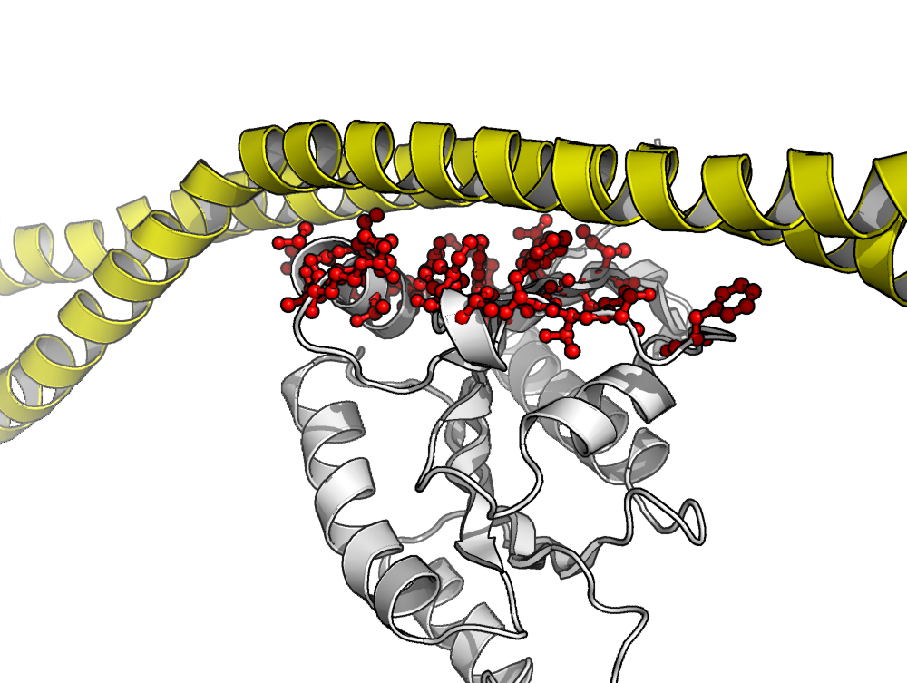
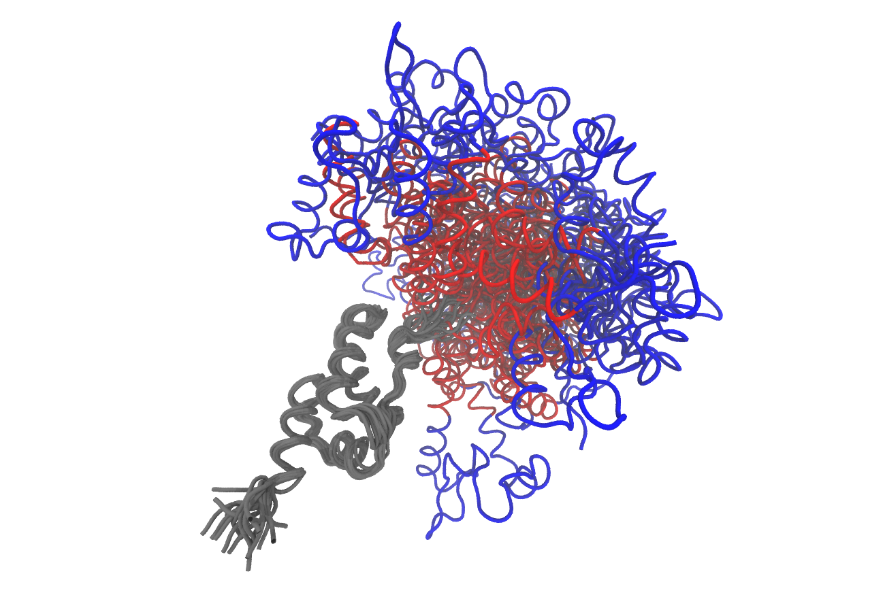

# Introduction

Bio3D[^1] is an R package containing utilities for the analysis of biomolecular
structure, sequence and trajectory data [@grant06].  Features include the ability
to read and write biomolecular structure, sequence and dynamic trajectory data,
perform atom selection, re-orientation, superposition, rigid core
identification, clustering, distance matrix analysis, conservation
analysis, normal mode analysis and principal component analysis. Bio3D
takes advantage of the extensive graphical and statistical capabilities of the 
[R environment](http://www.r-project.org) 
and thus represents a useful framework for exploratory analysis of structural data.


## Using this vignette
The aim of this document, termed a vignette[^2] in R parlance, is to provide a 
brief introduction to PDB structure analysis with Bio3D. A number of other Bio3D package vignettes are available, including:

-   `Installing Bio3D`

-   `Comparative protein structure analysis with Bio3D`

-   `Sequence conservation analysis with Bio3D`

-   `Beginning trajectory analysis with Bio3D`

-   `Dynamic network analysis with Bio3D`

-   `Normal mode analysis with Bio3D`


# Getting started
Start R (type R at the command prompt or, on Windows, double click on the R icon) 
and load the bio3d package by typing `library(bio3d)` at the R console prompt. 

```{r eval=TRUE, echo=TRUE}
library(bio3d)
```

Then use the command `lbio3d()` or `help(package=bio3d)` to list the functions within the package and `help(FunctionName)` to obtain more information about an individual function.
```{r eval=FALSE}
# List of bio3d function names
lbio3d()
# Function names with brief description
help(package=bio3d)
# Detailed help on a pca.xyz
help(pca.xyz)
```

To search the help system for documentation matching a particular word or topic use the 
command `help.search("topic")`. For example, `help.search("pdb")`

```{r eval=FALSE}
help.search("pdb")
```

Typing `help.start()` will start a local HTML interface to the R documentation and help system. 
After initiating `help.start()` in a session the `help()` commands will open as HTML pages. 

## Bio3d functions and their typical usage
The bio3d package consists of input/output functions, conversion and manipulation functions, analysis functions, and graphics functions all of which are fully documented both [online](http://thegrantlab.org/bio3d/html/index.html)) and within the R help system introduced in the previous section. 

To better understand how a particular function operates it is often helpful to view and execute an example. Every function within the bio3d package is documented with example code that you can view by issuing the `help()` command. 

Running the command `example(function)` will directly execute the example for a given function. 
In addition, a number of worked examples are available as [Tutorials](http://thegrantlab.org/bio3d/tutorials) on the bio3d website. 

```{r eval=FALSE}
example(plot.bio3d)
```


# Working with PDB files
Protein Data Bank files (or PDB files) are the most common format for the distribution and storage of high-resolution biomolecular coordinate data. The bio3d package contains functions for the reading (read.pdb, read.fasta.pdb, get.pdb, convert.pdb, basename.pdb), writing (write.pdb) and manipulation (trim.pdb, cat.pdb, pdbsplit, atom.select, pdbseq) of PDB files. Indeed numerous bio3d analysis functions are intended to operate on PDB file derived data (e.g. blast.pdb, chain.pdb, nma.pdb, pdb.annotate, pdbaln, pdbfit, struct.aln, dssp, pca.pdbs etc.)

At their most basic, PDB coordinate files contain a list of all the atoms of one or more molecular structures. Each atom position is defined by its x,y,z coordinates in a conventional orthogonal coordinate system. Additional data, including listings of observed secondary structure elements, are also commonly (but not always) detailed in PDB files.

## Read a PDB file
To read a single PDB file with bio3d we can use the read.pdb() function. The minimal input required for this function is a specification of the file to be read. This can be either the file name of a local file on disc or the RCSB PDB identifier of a file to read directly from the on-line PDB repository. For example to read and inspect the on-line file with PDB ID `4q21`: 

```{r eval=TRUE}
pdb <- read.pdb("4q21")
```

To get a quick summary of contents of the 'pdb' object you just created you can type pdb (or the equivalent print(pdb))

```{r eval=TRUE}
pdb
```

Note that the attributes ('+ attr:') of this object are listed on the last couple of lines. To find the attributes of any such object you can use:

```{r eval=TRUE}
attributes(pdb)
```

To access these individual attributes we use the dollar-attribute_name convention that is common with R list objects. For example:

```{r eval=TRUE}
print(pdb$xyz)
head(pdb$atom)

# Print $atom data for the first two atoms
pdb$atom[1:2, ]

# Print a subset of $atom data for the first two atoms
pdb$atom[1:2, c("eleno", "elety", "x","y","z")]

# Note that individual $atom records can also be accessed like this
pdb$atom$elety[1:2]     

# Which allows us to do the following
plot.bio3d(pdb$atom$b[pdb$calpha], sse=pdb, typ="l", ylab="B-factor")
```

Note that the main `xyz` coordinate attribute is a numeric matrix with 3N columns (each atom has three values x, y and z). The number of rows here correspond to the number of models in the PDB file (typically one X-ray structures and multiple for NMR structures).

```{r eval=TRUE}
# Examine coordinate data in $xyz
pdb$xyz
dim(pdb$xyz)
head(pdb$xyz) 
pdb$xyz[ 1, atom2xyz(1:2) ]
```

### Side-note: The 'pdb' class
Objects created by the read.pdb function are of class 'pdb'. This is recognized by other so called generic bio3d functions (for example atom.select, nma etc.). A generic function is a function that examines the class of its first argument, and then decides what type of operation to perform (more specifically it decides which specific method to dispatch to). So for example, the generic atom.select function knows that the input is of class 'pdb' rather than an AMBER parameter and topology file and will act accordingly. 

A careful reader will also of noted that our 'pdb' object created above also has a second class, namely 'sse' (see the output of 'attributes(pdb)' or class(pdb)'). This stands for 'secondary structure elements' and is recognized by the plot.bio3d function to annotate the positions of major secondary structure elements in the marginal regions of these plots (see Figure 1). This is all part of the R S3 object orientation system and a full discussion is beyond the scope of this introductory vignette. For our current purposes, we should realize that the object orientated nature of bio3d can simplify and facilitate our work with these types of objects.


## Atom selection 
The bio3d atom.select() function is arguably one of the most challenging for newcomers to master. This function operates on PDB structure objects (as created by read.pdb) and returns the numeric indices of a selected atom subset. These indices can then be used to access the $atom and $xyz attributes of PDB structure related objects. 

For example to find the indices for all C-alpha atoms we can use the following command:

```{r eval=TRUE}
# select all C-alpha atoms
ca.inds <- atom.select(pdb, "calpha")
ca.inds
```

Note that the attributes of the returned 'ca.inds' from atom.select include both atom and xyz components. These are numeric vectors that can be used to access the corresponding atom and xyz components of the input PDB structure object. For example:

```{r eval=TRUE}
# selected atoms
head( pdb$atom[ca.inds$atom, ] )
head( pdb$xyz[, ca.inds$xyz] )
```

In addition to the common selection strings (such as ‘calpha’ ‘cbeta’ ‘backbone’ ‘protein’ ‘notprotein’ ‘ligand’ ‘water’ ‘notwater’ ‘h’ and ‘noh’) various individual atom properties can be used for selection. 

```{r eval=TRUE, results="hide"}
# select chain I
a.inds <- atom.select(pdb, chain="A")

# select C-alphas of chain A
ca.inds <- atom.select(pdb, "calpha", chain="A")

# can combine multiple selection criteria to return their intersection
cab.inds <- atom.select(pdb, elety=c("CA","CB"), chain="A", resno=10:20)
```


#### Question:
Using atom.select how would you extract the amino acid sequence of your structure in 3-letter and 1-letter forms? 

#### Answer:
First select the C-alpha atoms, and use the returned atom indices to access the 'resid' values of pdb$atom.
```{r eval=TRUE}
aa3 <- pdb$atom$resid[ atom.select(pdb, "calpha")$atom ]
head(aa3)
```
From there you can use the utility function aa321 to convert to 1-letter from
```{r eval=TRUE}
aa321(aa3)
```

Note that if you tried searching with `help.search("PDB sequence", package="bio3d")` you likely found a bio3d function that essentially does this all for you. Namely pdbseq:

```{r eval=TRUE}
head( pdbseq(pdb) )
```
Given the large number of functions in the bio3d package using help.search can be an effective way to find functionality related to your specific task. 


## Write a PDB object
Use the command write.pdb to output a structure object to a PDB formatted file on your local disc.

```{r eval=TRUE, results="hide"}
# Output a backbone only PDB file to disc
b.inds <- atom.select(pdb, "back")
b.pdb <- trim.pdb(pdb, b.inds)
write.pdb(b.pdb, file="4q21_back.pdb")
```


## Manipulate a PDB object
Basic functions for concatenating, trimming, splitting, converting, rotating, translating and superposing PDB files are available but often you will want to manipulate the PDB objects in a custom way. 
Below we provide a basic example of such manipulation. We read in a multi-chained PDB structure in which we reassign residue numbers and chain identifiers.  


**WORK IN PROGRESS FROM HERE ON, CONTRIBUTIONS FROM OTHERS WELCOME.**

```{r eval=TRUE, results="hide"}
pdb <- read.pdb("4lhy")

# select chains A, E and F
inds <- atom.select(pdb, chain=c("A", "E", "F"))

# trim PDB to selection
pdb2 <- trim.pdb(pdb, inds)

# reassign chain identifiers
e.inds <- atom.select(pdb2, chain="E")
f.inds <- atom.select(pdb2, chain="F")

pdb2$atom$chain[ e.inds$atom ] <- "B"
pdb2$atom$chain[ f.inds$atom ] <- "B"

# renumber residues in chain B
b.inds <- atom.select(pdb2, chain="B")
j <- 0
dups <- duplicated(pdb2$atom$resno[ b.inds$atom ])
for(i in 1:length(b.inds$atom)) {
    if(!dups[i]) j <- j+1	
    pdb2$atom$resno[ b.inds$atom[i] ] <- j
}
```

```{r eval=TRUE, results='hide'}
# re-orient the PDB
xyz <- orient.pdb(pdb2)
write.pdb(pdb2, xyz=xyz, file="4LHY_AEF-oriented.pdb")
```


## Coordinate superposition and structural alignment
Structure superposition is essential for direct comparison of multiple structures. 
Bio3D offers versatile functionality to perform coordinate superposition at various levels. 
Below we demonstrate the use of functions **struct.aln()** and **fit.xyz**. 

Function **struct.aln()** performs a sequence alignment followed by a structural alignment of 
two PDB objects. This facilitates rapid superposition of two PDB structures with unequal, but
related PDB sequences. Below we use **struct.aln()** to superimpose the multi-chained PDB ID 
`4lhy` to PDB ID `4q21`:

```{r eval=TRUE, results='hide'}
# read two PKA structures
a <- read.pdb("4q21")
b <- read.pdb("4lhy")

# perform iterative alignment
#aln <- struct.aln(a, b)

# store new coordinates of protein B
#b$xyz <- aln$xyz
```

Note that **struct.aln()** performs cycles of refinement steps of the structural alignment
to improve the fit by removing atoms with a high structural deviation. At each cycle it prints
associated RMSD value of atoms included in the alignment. The resulting superimposed structures 
are optionally written to your hard drive at default folder with name `fitlsq/`. 

While **struct.aln()** operates on a pair of PDB objects, function **fit.xyz()** can perform
coordinate superposition on multiple structures. However, indices needs to provided ensuring the 
same number of atoms for which the fitting should be based. Below we superimpose a specific helix
of `4lhy` onto an equivalent helix of `4q21`: 


```{r eval=TRUE, results='hide'}
# indices at which the superposition should be based
a.ind <- atom.select(a, "//A/87:103///CA/")
b.ind <- atom.select(b, "//A/93:109///CA/")

# perform superposition
xyz <- fit.xyz(fixed=a$xyz, mobile=b$xyz,
               fixed.inds=a.ind$xyz,
               mobile.inds=b.ind$xyz)

# write coordinates to file
write.pdb(b, xyz=xyz, file="4LHY-at-4Q21.pdb")
```


## Concatenate multiple PDBs

```{r eval=TRUE, results='hide'}
a1 <- trim.pdb(a, atom.select(a, chain="A"))
b1 <- trim.pdb(b, atom.select(b, chain="A"))

b2 <- trim.pdb(b, atom.select(b, chain="E"))
b3 <- trim.pdb(b, atom.select(b, chain="F"))

# concatenate PDBs
new <- cat.pdb(a1, b1, b2, b3)
unique(new$atom$chain)

# write new PDB object to file
write.pdb(new, file="4Q21-4LHY.pdb")

```


## Binding site identification
```{r eval=TRUE, results='hide'}
# read two PKA structures
pdb <- read.pdb("4q21")
bs <- binding.site(pdb)
```

```{r eval=TRUE, results='hide'}
print(bs$resnames)
```


```{r eval=TRUE, results='hide'}
b <- read.pdb("4lhy")
b1 <- trim.pdb(b, atom.select(b, chain="A"))
b2 <- trim.pdb(b, atom.select(b, chain=c("E", "F")))

bs <- binding.site(b1, b2)

b1$atom$b[ bs$inds$atom ] <- 1
b1$atom$b[ -bs$inds$atom ] <- 0

write.pdb(b1, file="4LHY-interface.pdb")
```




# Working with multi-model PDB files

```{r eval=TRUE, results='hide'}
pdb <- read.pdb("1d1d", multi=TRUE)
ca.inds <- atom.select(pdb, 'calpha')

pdb$xyz

pdb$xyz[1:5, ca.inds$xyz]
```


## Identification of dynamic domains
```{r eval=TRUE, results='hide'}
# Domain analysis
gs  <- geostas(pdb)

# Fit all frames to the 'first' domain
domain.inds <- atom2xyz(which(gs$grps==1))

xyz <- fit.xyz(pdb$xyz[1, ca.inds$xyz],
               pdb$xyz[, ca.inds$xyz],
               fixed.inds = domain.inds,
               mobile.inds = domain.inds)

# write fitted coordinates
write.pdb(xyz=xyz, chain=gs$grps, file="1d1d_fit-domain1.pdb")
```




```{r eval=TRUE, results='hide'}
# Invariant core
core <- core.find(pdb$xyz[, ca.inds$xyz])

# fit to core region
xyz <- fit.xyz(pdb$xyz[1, ca.inds$xyz],
               pdb$xyz[, ca.inds$xyz],
               fixed.inds = core$xyz,
               mobile.inds = core$xyz)

# write fitted coordinates
write.pdb(xyz=xyz, file="1d1d_fit-core.pdb")
```


# Document Details {.unnumbered}
This document is shipped with the Bio3D package in both R and PDF formats. All code
can be extracted and automatically executed to generate Figures and/or the PDF with the following commands:

```{r eval=FALSE}
library(rmarkdown)
render("Bio3D_pdb.Rmd", "all")
```


# Information About the Current Bio3D Session {.unnumbered}
```{r}
sessionInfo() 
```


# References {.unnumbered}


[^1]: The latest version of the package, full documentation and further
    vignettes (including detailed installation instructions) can be
    obtained from the main Bio3D website:
    [thegrantlab.org/bio3d/](http://thegrantlab.org/bio3d/).

[^2]: This vignette contains executable examples, see `help(vignette)`
    for further details.

[^3]: See also dedicated vignettes for *ensemble NMA* provided with the Bio3D package.