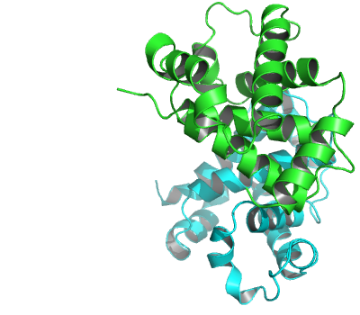
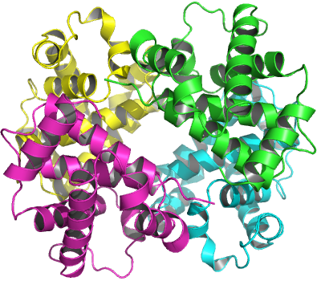

# Introduction {.unnumbered}

Bio3D[^1] is an R package containing utilities for the analysis of biomolecular
structure, sequence and trajectory data [@grant06, @skjaerven15].  Features include the ability
to read and write biomolecular structure, sequence and dynamic trajectory data,
perform atom selection, re-orientation, superposition, rigid core
identification, clustering, distance matrix analysis, conservation
analysis, normal mode analysis and principal component analysis. Bio3D
takes advantage of the extensive graphical and statistical capabilities of the 
[R environment](http://www.r-project.org) 
and thus represents a useful framework for exploratory analysis of structural data.


## New to R? {.unnumbered}
There are now numerous on–line resources that can help you get started using R. A number of these can be found from the main R website at http://www.r-project.org. We particularly like the following:

- [Try R](http://tryr.codeschool.com/): a nifty interactive R tutorial in your web browser
- [An introduction to R](http://cran.r-project.org/doc/manuals/R-intro.pdf): The offical R manual
- [Learn R](https://www.datacamp.com/): Learn by doing in your web browser (requires free registration)


## Using this vignette {.unnumbered}
The aim of this document, termed a vignette[^2] in R parlance, is to provide a 
brief introduction to PDB structure analysis with Bio3D. A number of other Bio3D package vignettes are available, including:

-   `Installing Bio3D`

-   `Comparative protein structure analysis with Bio3D`

-   `Beginning trajectory analysis with Bio3D`

-   `Dynamic network analysis with Bio3D`

-   `Normal mode analysis with Bio3D`


## Requirements {.unnumbered}
Detailed instructions for obtaining and installing the Bio3D package on various platforms can be found in the [Installing
 Bio3D Vignette](http://thegrantlab.org/bio3d/tutorials) available both on-line and from within the Bio3D package. 

## About this document {.unnumbered}
This vignette was generated using **Bio3D version `r packageVersion("bio3d")`**.


# Getting started
Start R (type R at the command prompt or, on Windows, double click on the R icon) 
and load the Bio3D package by typing `library(bio3d)` at the R console prompt. 

```{r eval=TRUE, echo=TRUE}
library(bio3d)
```

Then use the command `lbio3d()` or `help(package=bio3d)` to list the functions within the package and `help(FunctionName)` to obtain more information about an individual function.
```{r eval=FALSE}
# List of bio3d function names
lbio3d()

# Function names with brief description
help(package=bio3d)

# Detailed help on a pca.xyz
help(pca.xyz)
```

To search the help system for documentation matching a particular word or topic use the 
command `help.search("topic")`. For example, `help.search("pdb")`

```{r eval=FALSE}
help.search("pdb")
```

Typing `help.start()` will start a local HTML interface to the R documentation and help system. 
After initiating `help.start()` in a session the `help()` commands will open as HTML pages. 

## Bio3D functions and their typical usage
The Bio3D package consists of input/output functions, conversion and manipulation functions, analysis functions, and graphics functions all of which are fully documented both [online](http://thegrantlab.org/bio3d/html/index.html)) and within the R help system introduced in the previous section. 

To better understand how a particular function operates it is often helpful to view and execute an example. Every function within the Bio3D package is documented with example code that you can view by issuing the `help()` command. 

Running the command `example(function)` will directly execute the example for a given function. 
In addition, a number of worked examples are available as [Tutorials](http://thegrantlab.org/bio3d/tutorials) on the Bio3D website. 

```{r eval=FALSE}
example(plot.bio3d)
```


# Working with PDB files
Protein Data Bank files (or PDB files) are the most common format for the distribution and storage of high-resolution biomolecular coordinate data. The Bio3D package contains functions for the reading (**read.pdb()**, **read.fasta.pdb()**, **get.pdb()**, **convert.pdb()**, **basename.pdb()**), writing (**write.pdb()**) and manipulation (**trim.pdb()**, **cat.pdb()**, **pdbsplit()**, **atom.select()**, **pdbseq()**) of PDB files. Indeed numerous Bio3D analysis functions are intended to operate on PDB file derived data (e.g. **blast.pdb()**, **chain.pdb()**, **nma.pdb()**, **pdb.annotate()**, **pdbaln()**, **pdbfit()**, **struct.aln()**, **dssp()**, **pca.pdbs()** etc.)

At their most basic, PDB coordinate files contain a list of all the atoms of one or more molecular structures. Each atom position is defined by its x,y,z coordinates in a conventional orthogonal coordinate system. Additional data, including listings of observed secondary structure elements, are also commonly (but not always) detailed in PDB files.

## Read a PDB file
To read a single PDB file with Bio3D we can use the **read.pdb()** function. The minimal input required for this function is a specification of the file to be read. This can be either the file name of a local file on disc or the RCSB PDB identifier of a file to read directly from the on-line PDB repository. For example to read and inspect the on-line file with PDB ID `4q21`: 

```{r eval=TRUE}
pdb <- read.pdb("4q21")
```

To get a quick summary of contents of the `pdb` object you just created you can type `pdb` (or the equivalent `print(pdb)`):

```{r eval=TRUE}
pdb
```

Note that the attributes ('+ attr:') of this object are listed on the last couple of lines. To find the attributes of any such object you can use:

```{r eval=TRUE}
attributes(pdb)
```

To access these individual attributes we use the dollar-attribute_name convention that is common with R list objects. For example:

```{r eval=TRUE, fig.cap="Residue temperature factors for PDB ID `4q21` with SSE annotation in marginal regions plotted with function **plot.bio3d()**"}
print(pdb$xyz)
head(pdb$atom)

# Print $atom data for the first two atoms
pdb$atom[1:2, ]

# Print a subset of $atom data for the first two atoms
pdb$atom[1:2, c("eleno", "elety", "x","y","z")]

# Note that individual $atom records can also be accessed like this
pdb$atom$elety[1:2]     

# Which allows us to do the following
plot.bio3d(pdb$atom$b[pdb$calpha], sse=pdb, typ="l", ylab="B-factor")
```

Note that the main `xyz` coordinate attribute is a numeric matrix with 3N columns (each atom has three values x, y and z). The number of rows here correspond to the number of models in the PDB file (typically one X-ray structures and multiple for NMR structures).

```{r eval=TRUE}
# Examine coordinate data in $xyz
pdb$xyz
dim(pdb$xyz)
head(pdb$xyz) 
pdb$xyz[ 1, atom2xyz(1:2) ]
```

#### Side-note: The 'pdb' class {.unnumbered}
Objects created by the **read.pdb()** function are of class "pdb". This is recognized by other so called generic Bio3D functions (for example **atom.select()**, **nma()** etc.). A generic function is a function that examines the class of its first argument, and then decides what type of operation to perform (more specifically it decides which specific method to dispatch to). So for example, the generic **atom.select()** function knows that the input is of class "pdb" rather than an AMBER parameter and topology file and will act accordingly. 

A careful reader will also of noted that our "pdb" object created above also has a second class, namely "sse" (see the output of `attributes(pdb)` or `class(pdb)`). This stands for *secondary structure elements* and is recognized by the **plot.bio3d()** function to annotate the positions of major secondary structure elements in the marginal regions of these plots (see Figure 1). This is all part of the R S3 object orientation system and a full discussion is beyond the scope of this introductory vignette. For our current purposes, we should realize that the object orientated nature of Bio3D can simplify and facilitate our work with these types of objects.


## Atom selection 
The bio3d **atom.select()** function is arguably one of the most challenging for newcomers to master. This function operates on PDB structure objects (as created by **read.pdb()**) and returns the numeric indices of a selected atom subset. These indices can then be used to access the `$atom` and `$xyz` attributes of PDB structure related objects. 

For example to find the indices for all C-alpha atoms we can use the following command:

```{r eval=TRUE}
# select all C-alpha atoms
ca.inds <- atom.select(pdb, "calpha")
ca.inds
```

Note that the attributes of the returned `ca.inds` from atom.select include both `atom` and `xyz` components. These are numeric vectors that can be used to access the corresponding atom and xyz components of the input PDB structure object. For example:

```{r eval=TRUE}
# selected atoms
head( pdb$atom[ca.inds$atom, ] )

# selected xyz coordinates
head( pdb$xyz[, ca.inds$xyz] )
```

In addition to the common selection strings (such as ‘calpha’ ‘cbeta’ ‘backbone’ ‘protein’ ‘notprotein’ ‘ligand’ ‘water’ ‘notwater’ ‘h’ and ‘noh’) various individual atom properties can be used for selection. 

```{r eval=TRUE, results="hide"}
# select chain A
a.inds <- atom.select(pdb, chain="A")

# select C-alphas of chain A
ca.inds <- atom.select(pdb, "calpha", chain="A")

# can combine multiple selection criteria to return their intersection
cab.inds <- atom.select(pdb, elety=c("CA","CB"), chain="A", resno=10:20)
```

### Inverse selection

**atom.select()** also contain options to inverse the final selection. For example, including argument `inverse=TRUE` in the statement below will select all atoms except the water atoms:

```{r eval=TRUE, results="hide"}
# select all atoms excecpt waters
nowat.inds <- atom.select(pdb, "water", inverse=TRUE)
```

### Combining selections
The `operator` argument of **atom.select()** determines how to combine the individual selection statements. The operator is by default `"AND"` which specifies that the final selection is combined by intersection of the individual selection statements. Contrary, by setting `operator="OR"` the final selection is determined by the union of the individual statements. For example, the following selection will select all protein atoms as well as the GDP residue atoms:

```{r eval=TRUE, results="hide"}
# select protein + GDP
sele <- atom.select(pdb, "protein", resid="GDP", operator="OR")
```

Use argument `verbose=TRUE` to get information on how the selection is combined:
```{r eval=TRUE}
sele <- atom.select(pdb, "protein", elety=c("N", "CA", "C"), resno=50:60, verbose=T)
```

Function **combine.select()** provides further functionality to combine selections. For example the above selection of protein and GDP can be completed with:

```{r eval=TRUE, results="hide"}
a.inds <- atom.select(pdb, "protein")
b.inds <- atom.select(pdb, resid="GDP")
sele <- combine.select(a.inds, b.inds, operator="OR")
```

See `help(combine.select)` for more information. 


#### Question:
Using atom.select how would you extract the amino acid sequence of your structure in 3-letter and 1-letter forms? 

#### Answer:
First select the C-alpha atoms, and use the returned atom indices to access the `resid` values of `pdb$atom`.
```{r eval=TRUE}
aa3 <- pdb$atom$resid[ atom.select(pdb, "calpha")$atom ]
head(aa3)
```

From there you can use the utility function **aa321()** to convert to 1-letter from
```{r eval=TRUE}
aa321(aa3)
```

Note that if you tried searching with `help.search("PDB sequence", package="bio3d")` you likely found a bio3d function that essentially does this all for you. Namely **pdbseq()**:

```{r eval=TRUE}
head( pdbseq(pdb) )
```
Given the large number of functions in the bio3d package using `help.search` can be an effective way to find functionality related to your specific task. 


## Write a PDB object
Use the command **write.pdb()** to output a structure object to a PDB formatted file on your local hard drive. Below we use function **atom.select** to select only the backbone atoms, and **trim.pdb()** to create a new PDB object based on our selection of backbone atoms. Finally we used function **write.pdb() to write the newly generated PDB file containing only the backbone atoms:

```{r eval=FALSE, results="hide"}
# Output a backbone only PDB file to disc
b.inds <- atom.select(pdb, "back")
backpdb <- trim.pdb(pdb, b.inds)
write.pdb(backpdb, file="4q21_back.pdb")
```

#### Side-note:  {.unnumbered}
The selection statement can directly be provided into function **trim.pdb()**. Alternatively, function **atom.select()** can return the resulting trimmed `pdb` object using the argument `value=TRUE`:

```{r eval=FALSE, results="hide"}
# selection statement in trim.pdb()
backpdb <- trim.pdb(pdb, "backbone")

# or use value=TRUE in atom.select()
backpdb <- atom.select(pdb, "backbone", value=TRUE)
```


Function **write.pdb()** contains further arguments to change the specific data in the PDB structure object. For example, using argument `resno` the residue numbers in the PDB object will be changed according to the input values, e.g. for the purpose of renumbering a PDB object: 

```{r eval=FALSE, results="hide"}
# renumber pdb 
write.pdb(backpdb, resno=backpdb$atom$resno+10)

# use chain B
write.pdb(backpdb, chain="B")

```


## Manipulate a PDB object
Basic functions for concatenating, trimming, splitting, converting, rotating, translating and superposing PDB files are available but often you will want to manipulate the PDB objects in a custom way. 

Below we provide a basic example of such manipulation where we read in a multi-chained PDB structure, reassign chain identifiers, and renumber selected residues.

```{r eval=TRUE, results="hide"}
pdb <- read.pdb("4lhy")

# select chains A, E and F
inds <- atom.select(pdb, chain=c("A", "E", "F"))

# trim PDB to selection
pdb2 <- trim.pdb(pdb, inds)

# assign new chain identifiers
pdb2$atom$chain[ pdb2$atom$chain=="E" ] <- "B"
pdb2$atom$chain[ pdb2$atom$chain=="F" ] <- "C"

# re-number chain B and C
pdb2$atom$resno[ pdb2$atom$chain=="B" ] <- pdb2$atom$resno[ pdb2$atom$chain=="B" ] - 156
pdb2$atom$resno[ pdb2$atom$chain=="C" ] <- pdb2$atom$resno[ pdb2$atom$chain=="C" ] - 156

# assign the GDP residue a residue number of 500
pdb2$atom$resno[ pdb2$atom$resid=="GDP" ] <- 500

# use chain D for the GDP residue
pdb2$atom$chain[ pdb2$atom$resid=="GDP" ] <- "D"

# Center, to the coordinate origin, and orient, by principal axes,
# the coordinates of a given PDB structure or xyz vector. 
xyz <- orient.pdb(pdb2)

# write the new pdb object to file
write.pdb(pdb2, xyz=xyz, file="4LHY_AEF-oriented.pdb")
```


## Coordinate superposition and structural alignment
Structure superposition is essential for direct comparison of multiple structures. 
Bio3D offers versatile functionality to perform coordinate superposition at various levels. 
Below we demonstrate the use of functions **struct.aln()** and **fit.xyz**. 

#### Note: The struct.aln() function and MUSCLE {.unnumbered}
The _MUSCLE_ multiple sequence alignment program (available from the [muscle home page](http://www.drive5.com/muscle/)) 
must be installed on your system and in the search path for executables in order to run function **struct.aln()**. 
Please see the installation vignette for further details.

Function **struct.aln()** performs a sequence alignment followed by a structural alignment of 
two PDB objects. This facilitates rapid superposition of two PDB structures with unequal, but
related PDB sequences. Below we use **struct.aln()** to superimpose the multi-chained PDB ID 
`4lhy` to PDB ID `4q21`:

```{r eval=TRUE, results='hide'}
# read two G-protein structures
a <- read.pdb("4q21")
b <- read.pdb("4lhy")

# perform iterative alignment
aln <- struct.aln(a, b)

# store new coordinates of protein B
b$xyz <- aln$xyz
```

Note that **struct.aln()** performs cycles of refinement steps of the structural alignment
to improve the fit by removing atoms with a high structural deviation. At each cycle it prints
associated RMSD value of atoms included in the alignment. The resulting superimposed structures 
are optionally written to your hard drive at default folder with name `fitlsq/`. 


While **struct.aln()** operates on a pair of PDB objects, function **fit.xyz()** can perform
coordinate superposition on multiple structures. However, indices needs to provided ensuring the 
same number of atoms for which the fitting should be based. Below we superimpose a specific helix
of `4lhy` onto an equivalent helix of `4q21`: 


```{r eval=TRUE, results='hide'}
# indices at which the superposition should be based
a.ind <- atom.select(a, chain="A", resno=87:103, elety="CA")
b.ind <- atom.select(b, chain="A", resno=93:109, elety="CA")

# perform superposition
xyz <- fit.xyz(fixed=a$xyz, mobile=b$xyz,
               fixed.inds=a.ind$xyz,
               mobile.inds=b.ind$xyz)

# write coordinates to file
write.pdb(b, xyz=xyz, file="4LHY-at-4Q21.pdb")
```


For more information on Coordinate superposition see `help(fit.xyz)`.


## Concatenate multiple PDBs
Function **cat.pdb()** can be used to concatenate two or more PDB files. This function contains moreover arguments to re-assign residue numbers and chain identifiers. In the example below we illustrate how to concatenate `4q21` with specific components of `4lhy` into a new PDB object:


```{r eval=TRUE, results='hide'}
a1 <- trim.pdb(a, chain="A")

b1 <- trim.pdb(b, chain="A")
b2 <- trim.pdb(b, chain="E")
b3 <- trim.pdb(b, chain="F")

# concatenate PDBs
new <- cat.pdb(a1, b1, b2, b3, rechain=TRUE)
unique(new$atom$chain)

# write new PDB object to file
write.pdb(new, file="4Q21-4LHY.pdb")

```


## Binding site identification
Function **binding.site()** provides functionality to determine interacting residues between two PDB enteties or between two atom selections of a PDB object. This function reports the residues of selection 1 closer than a cutoff to selection 2. By default, **binding.site()** attempts to identify "protein" and "ligand" using **atom.select()**. Thus, to determine the binding site of PDB `4q21` only the `pdb` object needs to be provided:


```{r eval=TRUE, results='hide'}
# read G-protein structure
pdb <- read.pdb("4q21")
bs <- binding.site(pdb)
```

The output of **binding.site()** is a list containing (1) an `inds` component with a `select` object containing the atom and xyz indices of the identified binding site, (2) a `resnames` component containing formatted residue names of the binding site residues, (3) `resno` and `chain` components with residue numbers and chain identifiers for the binding site residues.


```{r eval=TRUE, results='show'}
# residue names of identified binding site
print(bs$resnames)
```

Alternatively, user defined atom selections can be provided to determine e.g. residues at the binding interface between two proteins:


```{r eval=TRUE, results='hide'}
b <- read.pdb("4lhy")

# atom selection
a.inds <- atom.select(b, chain="A")
b.inds <- atom.select(b, chain=c("E", "F"))

# identify interface residues
bs <- binding.site(b, a.inds=a.inds, b.inds=b.inds)

# use b-factor column to store interface in PDB file
b$atom$b[ bs$inds$atom ] <- 1
b$atom$b[ -bs$inds$atom ] <- 0

# write to file
write.pdb(b, file="4LHY-interface.pdb")
```


# Working with multi-model PDB files
Bio3D also reads multi-model PDB files which are frequently used to store NMR ensembles. To enable reading of all models you need to provide argument `multi=TRUE` to function **read.pdb()**. This will store the Cartesian coordinates of each model in the `xyz` component so that `nrow(xyz)` equals the number of models in the PDB structure. Several Bio3D functions works directly on these multi-model PDB objects. Below we provide an example of how to read and access the coordinates of a  multi-model PDB file. We then illustrate two functions for the analysis of a multi-model PDB file. 


```{r eval=TRUE, results='show'}
# read multi-model PDB file
pdb <- read.pdb("1d1d", multi=TRUE)

# xyz component contains 20 frames
pdb$xyz

# select a subset of protein
ca.inds <- atom.select(pdb, "calpha")

# access c-alpha coordinates of first 5 models
#pdb$xyz[1:5, ca.inds$xyz]

```


## Identification of dynamic domains
Function **geostas()** attempts to identify rigid domains in a protein (or
nucleic acid) structure based on its structural ensemble. Below we identify such domains and use function **fit.xyz()** to fit all models to one of the identified domains. We then use **write.pdb()** to store the aligned structures for visualization, e.g. in VMD:


```{r eval=TRUE, results='show', fig.width=5, fig.height=5, fig.cap="Plot of atomic movement similarity matrix with domain annotation for PDB ID `1d1d`"}
# Domain analysis
gs  <- geostas(pdb)

# Fit all frames to the 'first' domain
domain.inds <- gs$inds[[1]]

xyz <- pdbfit(pdb, inds=domain.inds)

# write fitted coordinates
write.pdb(pdb, xyz=xyz, chain=gs$atomgrps, file="1d1d_fit-domain1.pdb")

# plot geostas results
plot(gs, contour=FALSE)
```


## Invariant core identification
Function **core.find()** also works on a multi-model PDB file to determine the most invariant region a protein ensemble. Below we fit the NMR ensemble to the region identified by **core.find()**:

```{r eval=FALSE, results='hide'}
# Invariant core
core <- core.find(pdb)

# fit to core region
xyz <- pdbfit(pdb, inds=core)

# write fitted coordinates
write.pdb(pdb, xyz=xyz, file="1d1d_fit-core.pdb")
```

# Working with Biological Units
The primary PDB coordinate file of a crystal structure contains just one
crystal asymmetric unit, which may or may not be the same as the 
biologically-relevant assembly or biological unit. For example, the PDB
entry '2DN1', which contains crystal structure of human hemoglobin, only stores 
one pair of alpha and beta subunits (See Fig 7), while under physiological condition the 
protein actually works as a tetramer (two alpha and two beta subunits). 
In this case, the crystal asymetric unit is part of the biological unit. 
More generally, the asymmetric unit stored in a PDB file can be:

* One biological unit
* A portion of a biological unit
* Multiple biological units



Reconstruction of the biological unit from a PDB file is essential as to understand the
structure-function relationship one needs to work with the structural form in which the protein
performs function in solution. Most PDB files provide information about how to construct
biological units via symmetry operations (i.e. rotation and translation) performed on the stored coordinates. 
In *Bio3D*, the function **read.pdb()** automatically extracts such information and stored in the returned
'pdb' object. The function **biounit()** can then be called to build biological units based on the
'pdb' object. Following example illustrates the construction of the hemoglobin alpha2/beta2 tetramer
based on the PDB file containing alpha/beta dimer.

```{r}
pdb <- read.pdb("2dn1")
pdb$remark$biomat
```

The `$remark$biomat` component in a 'pdb' object describe the transformation (translation and rotation)
matrices that can be applied to construct biological units. It contains:

* **num**, the number of biological units described
* **chain**, a 'list' object. Each component is a vector of chain labels to which the transformation matrices are applied to get the corresponding biological unit
* **mat**, a 'list' of transformation matrices for each biological unit
* **method**, a character vector about the method ('AUTHOR' or 'SOFTWARE') that determined each biological unit

```{r}
biounit(pdb)
```

The function **biounit()** returns a 'list' object. Each component of the 'list' represents a possible 
biological unit stored as a 'pdb' object. In above example, two new chains (chain C and D) are constructed
from symmetry operations performed on the original chains (chain A and B). A molecular graph of the tetramer
is shown in Fig 8.




#### Side-note: {.unnumbered}
The biological unit described in a PDB file is not always unique. Distinct methods, e.g. based on 
expertise of authors of the crystallographic structure or calucaltion of software (See [here](http://www.rcsb.org/pdb/101/static101.do?p=education_discussion/Looking-at-Structures/bioassembly_tutorial.html) 
for more details), may determine different multimeric state. Also, as mentioned above, one crystal asymmetric 
unit may contain multiple biological units. The function **biounit()** returns all the possible biological units listed in the file (and that is why the return value is a 'list' instead of a simple 'pdb' object). 
It is dependent on users which biological unit is finally adopted for further analysis. Check the 'names' 
attributes of the returned 'list' for the determination method and multimeric state of each biological unit.
For example, the PDB entry '1KJY' describes three possible biological units for the G protein alpha subunit 
bound with GDI inhibitor. The common way is to select either one of the two dimers (they have slightly distinct
conformation) instead of the software predicted tetramer. 

```{r}
pdb <- read.pdb("1kjy")
bio <- biounit(pdb)
names(bio)
```


Optionally, **biounit()** returns the biological unit as a multi-model 'pdb' object. In this case,
the topology of the 'pdb' (e.g. `$atom`) is the same as input, whereas additional coordinates generated
via the symmetry operations are stored in distinc rows of `$xyz`. This is obtained by setting the argument
`multi=TRUE`. It is particular useful for speed enhancements with biological units containing many 
symmetric copies, for example a virus capsid: 

```{r}
pdb <- read.pdb("2bfu")
bio <- biounit(pdb, multi = TRUE)
bio
bio[[1]]$xyz
```

#### Question: {.unnumbered}
How to visulize the biological unit if `multi=TRUE`? **HINT:** Setting proper options in VMD to display multiple frames of a trajectory simultaneously.


# Where to Next
If you have read this far, congratulations! We are ready to have some fun and move to other package vignettes that describe more interesting analysis including advanced **Comparative Structure Analysis** (where we will mine available experimental data and supplement it with simulation results to map the conformational dynamics and coupled motions of proteins), **Trajectory Analysis** (where we analyze molecular dynamics simulation trajectories), enhanced methods for **Normal Mode Analysis** (where we will explore the dynamics of large protein families and superfamilies), and **Correlation Network Analysis** (where we will build and dissect dynamic networks form different correlated motion data).


# Document Details {.unnumbered}
This document is shipped with the Bio3D package in both R and PDF formats. All code
can be extracted and automatically executed to generate Figures and/or the PDF with the following commands:

```{r eval=FALSE}
library(rmarkdown)
render("Bio3D_pdb.Rmd", "all")
```


# Information About the Current Bio3D Session {.unnumbered}
```{r}
sessionInfo() 
```


# References {.unnumbered}


[^1]: The latest version of the package, full documentation and further
    vignettes (including detailed installation instructions) can be
    obtained from the main Bio3D website:
    [thegrantlab.org/bio3d/](http://thegrantlab.org/bio3d/).

[^2]: This vignette contains executable examples, see `help(vignette)`
    for further details.

[^3]: See also dedicated vignettes for *ensemble NMA* provided with the Bio3D package.
