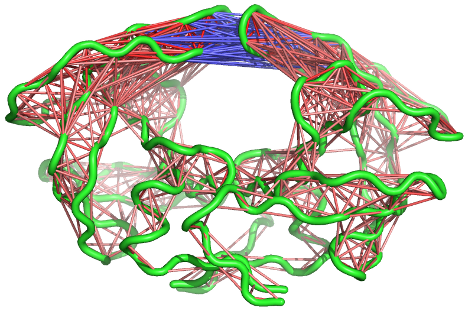

# Background {.unnumbered}

Bio3D[^1] is an R package that provides interactive tools for the
analysis of bimolecular structure, sequence and simulation data. The aim
of this document, termed a vignette[^2] in R parlance, is to provide a
brief task-oriented introduction to basic molecular dynamics trajectory
analysis with the Bio3D R package [@grant06].

## Requirements {.unnumbered}

Detailed instructions for obtaining and installing the Bio3D package on
various platforms can be found in the [Installing
Bio3D](http://thegrantlab.org/bio3d/tutorials) vignette available online.
This particular vignette was generated
using **Bio3D version `r packageVersion("bio3d")`**.


# Getting Started

Start R, load the Bio3D package and use the command `demo("md")` to get
a quick feel for some of the tasks that we will be introducing in the
following sections.

```{r, eval=FALSE}
library(bio3d)
demo("md")
```

```{r, echo=FALSE}
library(bio3d)
```

#### Side-note: {.unnumbered}

Note that you will be prompted to hit the `RETURN` key at each step of
the demo as this will allow you to see the particular functions being
called. Also note that detailed documentation and example code for each
function can be accessed via the `help()` and `example()` commands (e.g.
`help(read.pdb)`). You can also copy and paste any of the example code
from the documentation of a particular function, or indeed this
vignette, directly into your R session to see how things work. You can
also find this [documentation
online](http://thegrantlab.org/bio3d/html/index.html).
<br><br>

## Reading Example Trajectory Data

A number of example data sets are shipped with the Bio3D package. The
main purpose of including this data is to allow users to more quickly
appreciate the capabilities of various Bio3D functions that would
otherwise require potentially time consuming data generation. In the
examples below we will input, process and analyze a molecular dynamics
trajectory of Human Immunodeficiency Virus aspartic protease (HIVpr).
This trajectory is stored in CHARMM/NAMD DCD format and has had all
solvent and non C-alpha protein atoms excluded to reduce overall file
size.

The code snippet below sets the file paths for the example HIVpr
starting structure (pdbfile) and trajectory data (dcdfile).

```{r}
dcdfile <- system.file("examples/hivp.dcd", package="bio3d")
pdbfile <- system.file("examples/hivp.pdb", package="bio3d")
```

#### Side-note: {.unnumbered}

Note that in the above example the `system.file()` command returns a
character string corresponding to the file name of a PDB structure
included with the Bio3D package. This is required as users may install
the package in different locations. When using your own input files the
`system.file()` command will not be required, for example

```{r, eval=FALSE}
mydcdfile <- "/path/to/my/data/myfile.dcd"
```

<br>

```{r readtrj, results="hide", cache=TRUE}
dcd <- read.dcd(dcdfile)
pdb <- read.pdb(pdbfile)
```

The `read.dcd()` and `read.pdb()` commands
processes the input files and returns their output to the new objects
`dcd` and `pdb`. We can check the basic structure of these objects with
the following commands:

```{r}
print(pdb)
print(pdb$xyz)
print(dcd)
```

The output of the above function is telling us that we have 351 trajectory frames and 594 coordinates. The trajectory information is stored in a  `xyz` matrix object with one row per frame and columns for the Cartesian coordinates (x, y and z columns).

#### Question: {.unnumbered}

How many atoms are in the trajectory and PDB files?

#### Question: {.unnumbered}

How would you extract the amino acid sequence of the HIVpr system in
1-letter and 3-letter forms? HINT: try `help.search("PDB sequence")` for a Bio3D function that might help you.

#### Side-note: {.unnumbered}

Note that typically one works with trajectory files that contain all
protein atoms, or at the very least all backbone atoms. Solvent however
can often be excluded prior to Bio3D input - it just depends upon your
particular analysis questions. For example, we are not able to analyze
Hydrogen bonding patterns or details of water occupancy with the
currently inputed data.
<br><br>

# Trajectory Frame Superposition

In this simple example we select all C-alpha atoms for trajectory frame
superposition.

```{r}
ca.inds <- atom.select(pdb, elety="CA")
```

The returned `ca.inds` object is a list containing atom and xyz numeric
indices that we can now use to superpose all frames of the trajectory on
the selected indices (in this case corresponding to all alpha Carbon
atoms). For this we will with the `fit.xyz()` function.

```{r}
xyz <- fit.xyz(fixed=pdb$xyz, mobile=dcd,
               fixed.inds=ca.inds$xyz,
               mobile.inds=ca.inds$xyz)
```

The above command performs the
actual superposition and stores the new coordinates in the matrix object
`xyz`. Note that the dimensions (i.e. number of rows and columns, which
correspond to frames and coordinates respectively) of `xyz` match those
of the input trajectory:

```{r}
dim(xyz) == dim(dcd)
```

#### Question: {.unnumbered}

How would you fit trajectory frames on the Calpha atoms of residues 24
to 27 and 85 to 90 in both chains? HINT: See the example section of
`help(atom.select)`.

#### Question: {.unnumbered}

Would you expect the alternate fitting suggested above to alter your
later results? HINT: You can come back to this question later after
going through the other sections.

#### Side-note: {.unnumbered}

A simple way to obtain the average structure from your fitted trajectory
is to use the following command `apply(xyz,2,mean)`.
<br><br>

# Root Mean Square Deviation (RMSD)

RMSD is a standard measure of structural distance between coordinate
sets and is implemented in the Bio3D function `rmsd()`.

```{r, warning=FALSE, fig.cap="Simple time series of RMSD from the initial structure (note periodic jumps that we will later see correspond to transient openings of the flap regions of HIVpr)"}
rd <- rmsd(xyz[1,ca.inds$xyz], xyz[,ca.inds$xyz])

plot(rd, typ="l", ylab="RMSD", xlab="Frame No.")
points(lowess(rd), typ="l", col="red", lty=2, lwd=2)
```

A quick histogram can be useful for examining the distribution of RMSD
values.

```{r, echo=TRUE, fig.cap="Note the spread of RMSD values and that the majority of sampled conformations are around 2 Angstroms from the starting structure"}
hist(rd, breaks=40, freq=FALSE, main="RMSD Histogram", xlab="RMSD")
lines(density(rd), col="gray", lwd=3)
```

```{r}
summary(rd)
```

#### Question: {.unnumbered}

How would you calculate the pairwise RMSD between all frames?

#### Question: {.unnumbered}

What would be a good way to visualize and further analyze such a
pairwise RMSD matrix? HINT: Have a look at the NMA vignette for some,
hopefully, inspiring plots?
<br><br>

# Root Mean Squared Fluctuations (RMSF)

RMSF is an often used measure of conformational variance and is
implemented in the Bio3D function `rmsf()`. This analysis will highlight
the portions of structure that are fluctuating from their mean structure
the most (and least).

```{r, echo=TRUE, fig.cap="Residue-wise RMSF indicates regions of high mobility"}
rf <- rmsf(xyz[,ca.inds$xyz])
plot(rf, ylab="RMSF", xlab="Residue Position", typ="l")
```

#### Question: {.unnumbered}

If you had multiple simulations (which by the way we greatly encourage), how would you plot these on the same graph? HINT: See `help(points)`.

#### Question: {.unnumbered}

If you noticed differences at particular sites (e.g. in the presence or
absence of a ligand) how would you go about addressing the significance
of these differences? HINT: this is why we always encourage a multiple
simulation approach and implement Bio3D in one of the most advanced
statistical analysis packages available.
<br><br>

# Principal Component Analysis

PCA can be employed to examine the relationship between different
conformations sampled during the trajectory and is implemented in the
Bio3D functions `pca.xyz()` and `pca.tor()`. The application of PCA to
both distributions of experimental structures and molecular dynamics
trajectories will be covered in detail in other vignettes. Briefly, we
will note here that this method can provide considerable insight into
the nature of conformational differences with the resulting principal
components (orthogonal eigenvectors) describing the axes of maximal
variance of the distribution of structures. Projection of the
distribution onto the subspace defined by the largest principal
components results in a lower dimensional representation of the
structural dataset (see `Figure 4`). The percentage of the total mean
square displacement (or variance) of atom positional fluctuations
captured in each dimension is characterized by their corresponding
eigenvalue (see `Figure 4D`). Experience suggests that 3–5 dimensions
are often sufficient to capture over 70 percent of the total variance in
a given family of experimental structures or indeed a standard molecular
dynamics trajectory. Thus, a handful of principal components are
sufficient to provide a useful description while still retaining most of
the variance in the original distribution [@grant06].

A quick overview of the results of `pca.xyz()` can be obtained by
calling `plot.pca()`

```{r, echo=TRUE, fig.cap="PCA results for our HIVpr trajectory with instantaneous conformations (i.e. trajectory frames) colored from blue to red in order of time"}
pc <- pca.xyz(xyz[,ca.inds$xyz])
plot(pc, col=bwr.colors(nrow(xyz)) )
```

Note that there are distinct groupings of conformations along the PC1 plane (one centered around -30 and a second, larger grouping, at +5). The continuous color scale (from blue to whit to red) indicates that there are periodic jumps between these conformers throughout the trajectory. Below we perform a quick clustering in PC-space to further highlight these distinct conformers.

```{r, echo=TRUE, fig.cap="Simple clustering in PC subspace"}
hc <- hclust(dist(pc$z[,1:2]))
grps <- cutree(hc, k=2)
plot(pc, col=grps)
```

#### Question: {.unnumbered}

How can we find out which frames correspond to the distinct groups along PC1? HINT: Which variable/object created above tells us about cluster membership?
<br><br>

Bellow we call `plot.bio3d()` to examine the contribution of each
residue to the first two principal components.

```{r, echo=TRUE, fig.cap="Residue-wise loadings for PC1 (black) and PC2 (blue)"}
plot.bio3d(pc$au[,1], ylab="PC1 (A)", xlab="Residue Position", typ="l")
points(pc$au[,2], typ="l", col="blue")
```

#### Question: {.unnumbered}

Why do you think there might be two major peaks in our RMSF plot?
<br><br>

To further aid interpretation, a PDB format trajectory can be produced
that interpolates between the most dissimilar structures in the
distribution along a given principal component. This involves dividing
the difference between the conformers into a number of evenly spaced
steps along the principal components, forming the frames of the output
multi-model PDB trajectory. Such trajectories can be directly visualized
in a molecular graphics program, such as VMD [@vmd]. Furthermore,
the interpolated structures can be analyzed for possible domain and
shear movements with other Bio3D functions, or used as initial seed
structures for reaction path refinement methods (note you will likely
want to perform all heavy atom PCA for such applications).

```{r, eval=FALSE}
p1 <- mktrj.pca(pc, pc=1, b=pc$au[,1], file="pc1.pdb")
p2 <- mktrj.pca(pc, pc=2,b=pc$au[,2], file="pc2.pdb")
```

You can also write these trajectory’s as AMBER NetCDF format files with
the `write.ncdf` function. To view the PDB trajectories in VMD just open
the files in the normal way and display as tube representation for
example (see figure below).

```{r, eval=FALSE}
write.ncdf(p1, "trj_pc1.nc")
```


#### Question: {.unnumbered}

Which regions are the most dynamic and why?
<br><br>

# Cross-Correlation Analysis

The extent to which the atomic fluctuations/displacements of a system
are correlated with one another can be assessed by examining the
magnitude of all pairwise cross-correlation coefficients. The Bio3D
`dccm()` function returns a matrix of all atom-wise cross-correlations
whose elements may be displayed in a graphical representation frequently
termed a dynamical cross-correlation map, or DCCM.

```{r, echo=TRUE, results="hide", fig.cap="Dynamical cross-correlation map (DCCM) calculated with function **dccm()** using the MD simulation of HIV-1 protease as input."}
cij<-dccm(xyz[,ca.inds$xyz])
plot(cij)
```

#### Question: {.unnumbered}

What do the off-diagonal regions of negative correlation correspond to
in this plot and which regions are involved? HINT: Negative values
typical indicate regions that move in opposite directions.
<br><br>

A 3D visualization of these correlations can be provided through the
function `view.dccm()`

```{r, eval=FALSE}
# View the correlations in pymol
view.dccm(cij, pdb, launch=TRUE)
```



See also the `Enhanced Methods for Normal Mode Analysis` for additional
visualization examples. Also you might want to checkout the
`Comparative Analysis of Protein Structures` vignette for relating
results like these to available experimental data. The logical expansion
of this analysis is described in the `Correlation Network Analysis`
vignette.
<br><br>

# Where to Next

If you have read this far, congratulations! We are ready to have some
fun and move to [other package vignettes](http://thegrantlab.org/bio3d/tutorials) that describe more interesting
analysis including Correlation Network Analysis (where we will build and
dissect dynamic networks form different correlated motion data),
enhanced methods for Normal Mode Analysis (where we will explore the
dynamics of large protein families and superfamilies), and advanced
Comparative Structure Analysis (where we will mine available
experimental data and supplement it with simulation results to map the
conformational dynamics and coupled motions of proteins).
<br><br>


# Document Details {.unnumbered}
This document is shipped with the Bio3D package in both R and PDF formats. All code can be extracted and automatically executed to generate Figures and/or the PDF with the following commands:

```{r eval=FALSE}
library(rmarkdown)
render("Bio3D_md.Rmd", "all")
```

# Information About the Current Bio3D Session {.unnumbered}

```{r}
sessionInfo()
```

<br>

# References {.unnumbered}


[^1]: The latest version of the package, full documentation and further
    vignettes (including detailed installation instructions) can be
    obtained from the main Bio3D website:
    [http://thegrantlab.org/bio3d/](http://thegrantlab.org/bio3d/)

[^2]: This vignette contains executable examples, see `help(vignette)`
    for further details.
